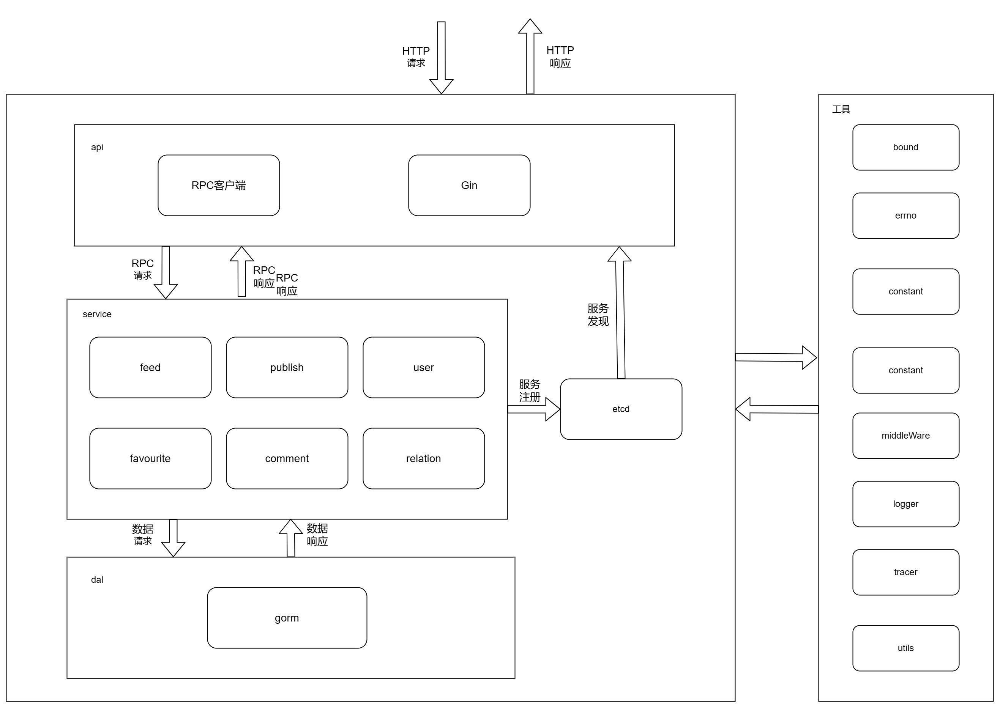

# Aweme-Kitex(基于Kitex的简易版Aweme)
## 1.介绍

- 1.基于RPC框架**Kitex**、HTTP框架**Gin**、ORM框架**GORM**的Aweme服务端项目
- 2.代码采用api层、service层、dal层三层结构
- 3.使用Kitex构建RPC微服务，Gin构建HTTP服务
- 4.GORM操作MySQL数据库，防止SQL注入，使用事务保证数据一致性，完整性，使用redis保存用户信息
- 5.使用**ETCD**进行服务注册、服务发现，**Jarger**进行链路追踪
- 6.使用**MySQL**数据库进行数据存储，并建立索引，利用redis进行缓存
- 7.使用**OSS**进行视频对象存储，上传视频和封面
- 8.使用**JWT**鉴权，**MD5**密码加密，**ffmpeg**处理视频
- 9.进行了**部分单元测试**，api**自动化测试**，[Postman](https://api.postman.com/collections/22021660-83a8235f-4e00-48e7-ab5f-88c62b61c47c?access_key=PMAT-01GS5K8MV2RF39KMPE3MG5QTV9)
- 10.使用logrus进行log本地记录，支持日志写入kafka
## 2.服务名称

| 服务名   | 用途                               | 框架                    | 协议  | 注册中心 | 链路追踪 | 数据存储            | 日志      | 队列      |  
| -------- | ---------------------------------- | ----------------------- |-----| -------- | -------- |-----------------|---------|---------|
| api      | http接口，通过RPC客户端调用RPC服务 | `gin` `kitex`           | `http` | `etcd`   | `jaeger` |                 | `logus` | `-`     |
| feed     | 视频流RPC微服务                    | `kitex` `gorm`          | `thrift` | `etcd`   | `jaeger` | `mysql`         | `logus` | `-`     |
| publish  | 视频上传RPC微服务                  | `kitex` `gorm` `ffmpeg` | `thrift` | `etcd`   | `jaeger` | `mysql` `oss`   | `logus` | `-`     |
| user     | 用户RPC微服务                      | `kitex` `gorm` `jwt`    | `thrift` | `etcd`   | `jaeger` | `mysql` `redis` | `logus` | `kafka` |
| favorite | 点赞RPC微服务                      | `kitex` `gorm`          | `thrift` | `etcd`   | `jaeger` | `mysql`         | `logus` | `kafka` |
| comment  | 评论RPC微服务                      | `kitex` `gorm`          | `thrift` | `etcd`   | `jaeger` | `mysql redis`   | `logus` | `kafka` |
| relation | 关注RPC微服务                      | `kitex` `gorm`          | `thrift` | `etcd`   | `jaeger` | `mysql`         | `logus` | `-`     |
## 3.文件说明<br>
| 目录               | 说明                                                    |
|------------------|-------------------------------------------------------|
| cfg              | 项目配置相关信息，包含了mysql、COS、redis的初始化等                      | 
| cmd/api          | api层代码，处理外部http请求，通过rpc客户端发起rpc请求                     |
| cmd/feed         | 视频流微服务，包含获取视频流功能，处理api层rpc请求，调用dal层处理数据               |
| cmd/publish      | publish微服务，包含视频上传、视频列表等功能，处理api层rpc请求，调用dal层处理数据      |
| cmd/user         | user微服务，包含用户注册、用户登录、用户信息等功能，处理api层rpc请求，调用dal层处理数据    |
| cmd/favorite     | favorite微服务，包含点赞、取消点赞、点赞列表等功能，处理api层rpc请求，调用dal层处理数据  |
| cmd/comment      | comment微服务，包含增加评论，删除评论，评论列表等功能，处理api层rpc请求，调用dal层处理数据 |
| cmd/relation     | relation微服务，包含关注、取消关注、关注列表等功能，处理api层rpc请求，调用dal层处理数据  |
| models/dal       | 数据库相关信息，包含了DDL、使用gorm进行底层数据库操作等                       |
| idl              | thrift IDL文件                                          |
| pkg/bound        | 限制CPU的相关代码                                            |
| pkg/constant     | 项目中的配置及常量代码                                           |
| pkg/errno        | 错误码的代码封装                                              |
| pkg/jwt          | jwt鉴权的代码封装                                            |
| pkg/middlewarare | rpc的中间件                                               |
| pkg/logger       | zap log的封装                                            |
| pkg/tracer       | 初始化jaeger                                             |
| pkg/utils        | 时间戳等相关工具功能的封装                                         |
| public           | 存放本地视频以及项目相关文件                                                
| .env             | 项目的环境变量(脱敏)                                                

## 4.组件
| 名称              | 版本 | 说明                                                    |
|-----------------|---|-------------------------------------------------------|
| go              | v1.18 |    
| kitex           | v0.4.4 | [RPC框架](https://www.cloudwego.io/zh/docs/kitex/)   
| gin             | v1.8.1 | [http服务框架](https://gin-gonic.com/zh-cn/)   
| gorm            | v1.24.1 | [项目orm](https://www.kancloud.cn/sliver_horn/gorm/1861153)   
| go-redis        | v6.15.9 | redis组件
| jwt-go          | v3.20 | jwt组件   
| go-uuid         | v1.0.3 | generate uuid   
| logrus          | v1.24.0 | [log组件](https://)   
| kafka           | v1.24.0 | [队列](https://)   
| logkafka-hook   | v1.1.0 | log hook组件支持写入kafka
| cos-go-sdk-v5   | v7.40.0 | [腾讯云对象存储组件](https://cloud.tencent.com/document/product/436/31215)   
| ffmpeg-go       | v0.4.1 | ffmpeg组件(github.com/u2takey/ffmpeg-go)   
| registry-etcd   | v1.18 | [etcd](https://blog.csdn.net/weixin_41760738/article/details/115768806)   ```etcd -listen-client-urls="http://0.0.0.0:2379" --advertise-client-urls="http://0.0.0.0:2379"```  
| jaeger-client-go | v2.30.0 | tracer组件(参考网上相关资料)   
| godotenv        | v1.40.0 | [env组件](https://www.cnblogs.com/zhangmingcheng/p/15802038.html)   
## 4. 调用关系


<center>功能结构图 (from 飞书文档)</center>


<center>功能结构图同上 (from 飞书文档)</center>

## 5. 代码运行

#### 运行feed微服务
```shell
    cd cmd/feed
    sh build.sh
    sh output/bootstrap.sh
```

#### 运行publihs微服务
```shell
    cd cmd/publish
    sh build.sh
    sh output/bootstrap.sh
```

#### 运行user微服务
```shell
    cd cmd/user
    sh build.sh
    sh output/bootstrap.sh
```

#### 运行favourite微服务
```shell
    cd cmd/favourite
    sh build.sh
    sh output/bootstrap.sh
```

#### 运行relation微服务
```shell
    cd cmd/relation
    sh build.sh
    sh output/bootstrap.sh
```

#### 运行comment微服务
```shell
    cd cmd/comment
    sh build.sh
    sh output/bootstrap.sh
```

## 6. 踩坑记录
1. os.getenv("MYSQL_PASSWD")读取失败 
   - 原因：将MYSQL_PASSWD只配置到了当前用户的.bash中，goland运行的时候，读取不到，读到"";
   - 解决方法：利用godotenv，将部分信息配置到.env中; 
   - 参考: https://www.cnblogs.com/zhangmingcheng/p/15802038.html。


2. JSON omitempty的时候会自动忽略false等 
   - golang在处理json转换时，对于标签omitempty定义的field，如果给它赋得值恰好等于空值（比如：false、0、""、nil指针、nil接口、长度为0的数组、切片、映射），则在转为json之后不会输出这个field;
   - 所以如果属性用了omitempty，前端会不显示;
   - 参考：https://www.jianshu.com/p/ffff11015ccf。
## 7.todo
1. 补全单元测试

## 8.参考资料
   - 腾讯云对象存储Go SDK(https://cloud.tencent.com/document/product/436/31215)
   - CloudWeGO (https://www.cloudwego.io/zh/docs/kitex/overview/)